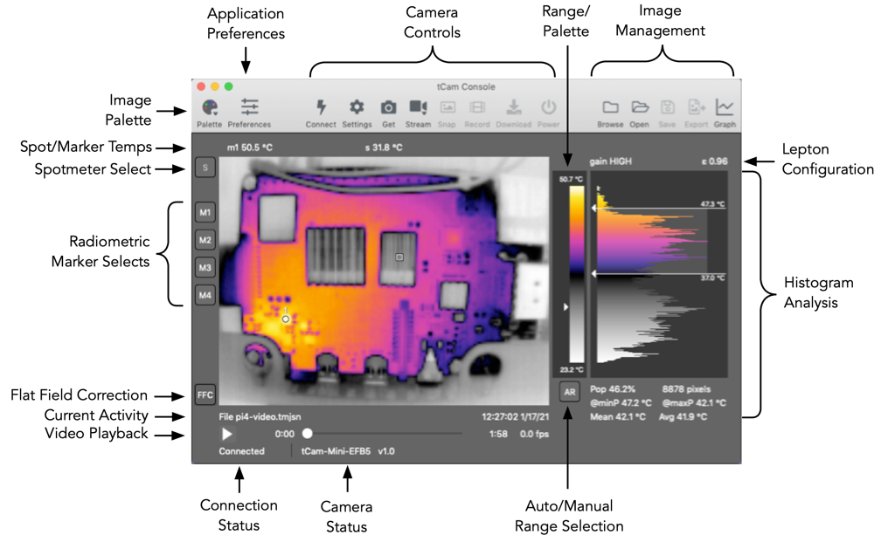
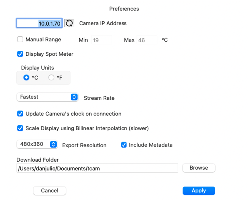
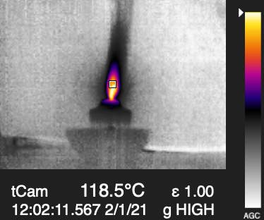
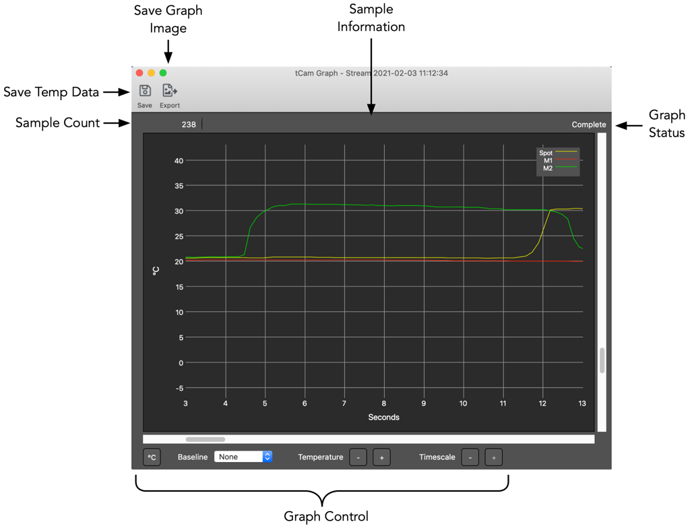
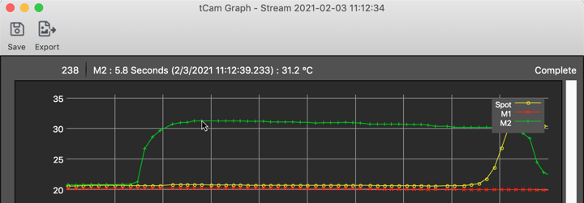
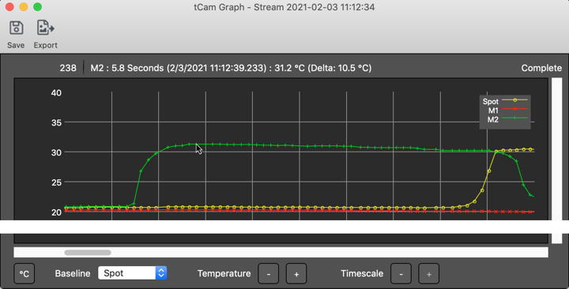
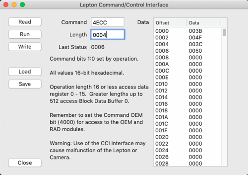
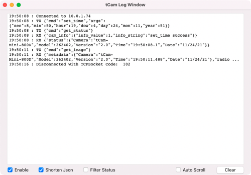

## tCam Desktop Application

This repository contains the companion desktop application for the tCam cameras.  It communicates with the cameras via a network connection using their json packet command set.  It provides functionality to control the cameras, download and display data from them and analyze the radiometric data.

* Get a current image.
* Stream images from a connected camera at various rates.
* Control remote picture and video recording and download images from the camera's local storage (tCam only).
* Save and load radiometric image files.
* Save and load radiometric video (stream) files.
* Export radiometric data as a common format image file.
* Graph temperature at up to five points from a stream or video file.
* Update camera firmware (tCam-Mini requires FW 2.0 and beyond).

The application is developed using the [xojo](https://www.xojo.com) development environment.  64-bit binary images are provided for Mac OS X, Windows and x86 Linux systems.  A 32-bit binary image is provided for Raspbian.  Download the zip file for your platform.  The application can be run directly from the unzipped directory by double clicking the application binary icon.

Note: Zip files for each application platform can be downloaded directly from my [website](http://danjuliodesigns.com/products/tcam_mini.html) as well if you don't want to clone this entire repository.

#### Version History
2.1.1

1. Fixed, yet again, AGC display of spot meter information…*sigh*

2.1.0 - Major performance enhancement

1. Optimize compilation and add preference item to disable bilinear interpolation if desired to increase performance on slow computers and when the image has been resized.  This fixes the issue where the UI seemed frozen while streaming.
2. Add check for minimum 8-character password when setting Wifi.
3. Fix bug where spot meter info is displayed when AGC enabled on a camera with a Lepton 3.5.
4. Fixed bugs in displaying garbage metadata when exporting images from a camera with a Lepton 3.0.
5. Fixed bug where application could crash when exporting an image to a protected directory.
6. Increased the width of some labels to display fully on Linux.

2.0.0 - Major update

1. Add support for Lepton 3.0.
2. Restore main window image display to default 480x320 pixel and allow main window to be resized.
3. Changed log window to be able to shorten any long json packet.
4. Added Banded, Black Hot and Sepia color palettes.
5. Added support for OTA FW updates.
6. Modified FPS calculations to use image timestamps (instead of local timestamps) and average across all samples.
7. Misc internal clean up and minor bug fixes.

1.2.1 - Fix IP address entry for international users.

#### Platform Caveats

1. You may need to make the Linux application file executable.
2. You may also have to authorize the application on OS X or Windows platforms since I don't yet sign it or package it for distribution in their online stores.
3. Different Linux desktop systems render the toolbar differently and all toolbar items aren't visible since Linux renders the text next to the icon instead of beneath it.  You can make the window wider to expose some important controls like Stream that has sub-menus or you can use the pull-down menus at the top of the window.

An advance apology - I develop on my Mac and do quick tests on Windows 7 and 10, and Ubuntu, Kubuntu and Raspbian.  Although xojo provides pretty good cross-platform compatibility for OS X and Windows, sometimes there are issues with Linux.  If you find some other issue, please let me know and I'll try to fix it.


### Main Window


Main window operation is described below.

### Preferences


The preferences window is used to configure the application.  Preferences are stored on the computer and loaded each time the application starts.

* Camera IP Address - Set the camera's IP address.  Clicking the refresh button sets the computer's current network IP4 address with the lowest octet set to "1".  If the camera is acting as an AP then this address will be the camera address "192.168.4.1".  If the camera and computer are both connected to an external AP then replace the lowest octet with the address associated with the camera.
* Manual Range - Allows setting a specific manual temperature range for the display of radiometric images.
* Display Units - Allows setting the unit display used throughout the main window.
* Stream Rate - Allows setting the requested stream rate from the camera when streaming is enabled (fastest possible rate down to one image every five minutes)
* Update Camera Clock - Causes the application to set the camera's built-in clock to the current computer time on each connection.  The clock is used to timestamp images.
* Scale Display using Bilinear interpolation - Uses an algorithm that results in a slightly smoother image as it is increased from the camera's native 160x120 pixel resolution.  De-selecting this uses a much faster algorithm that will work better on slower computers and when resizing the image at the cost of some smoothness.
* Export Resolution - Sets the size of an exported image (160x120 pixels to 640x480 pixels) and specifies if only the image or the image plus additional information is rendered to the exported file.
* Download Folder - Sets the default folder for downloaded/saved images.

### Connecting to a Camera
The tCam cameras operate in one of two WiFi modes.  By default they act as an Access Point (AP) and create their own WiFi network with the SSID "tCam-XXXX" or "tCam-Mini-XXXX" where XXXX are four hexadecimal digits.  This makes it easy to connect to a camera right away.  Once connected the camera may be reconfigured using the application to connect to an existing WiFi network, either getting a DHCP served IPV4 address from the network's router or with a statically assigned IPV4 address.  This makes it possible for the computer running the application to talk to both the camera and the internet at large.

The application will display a pop-up message box with the description "TCPSocket Error: 22" when it cannot connect to a camera.  The message is displayed after about 20-30 seconds when the internal socket connection times out.  This usually means the computer and camera are either not on the same WiFi network or the Camera IP Address preference is not correctly set to match the camera.

#### Connecting to a camera as Access Point
Configure the computer to connect to the camera's SSID.  The camera always has a IPV4 address of "192.168.4.1" when it is acting as an Access Point so this number should be entered into the application preference's Camera IP Address field (this is the application's default value).  Press the Connect button after configuring or verifying the preference IP address field.

Note: A tCam-Mini user attempting to connect using a Windows computer in an environment with a large number of other WiFi networks reported having difficulty.  There may be some issue with the Espressif WiFi network stack along with my code's task scheduling and Windows computers.  I haven't been able to replicate or figure out what might be going on yet.  A connection was made when the computer and tCam-Mini were moved to a less busy environment.

#### Configuring the camera to connect to another WiFi network
Once connected the application can be used to reconfigure the camera to connect to an existing WiFi network using the Settings button as described below (Camera Settings Window).  The camera may be configured to either get a DHCP served IPV4 address from the router or given a static IPV4 address on the network.

#### Connecting to a camera connected to another WiFi network
Connecting to a camera on an existing WiFi network requires the camera's IPV4 address to be entered into the application preference's Camera IP Address field before pressing Connect.  It may be necessary to log into the WiFi router or use a utility program (for example Fing on Android or nmap on Linux) to obtain the camera's IPV4 address if it has been assigned automatically using DHCP.

### Application Operation
The application is oriented around radiometric image files.  It always displays the last image it processed.  This may be a static image loaded from a file or taken by an attached camera.  It may also be a series of images from a video file or streamed from the camera.  Each image is displayed using a selected Palette to provide a false color image.  The 16-bit radiometric data is linearly scaled to 8-bits and the selected palette used to generate 24-bit RGB pixel colors.  When the camera is configured into AGC mode the 8-bit data from the camera is used directly with the selected palette.

Note that while the application is designed primarily for use with radiometric image files, it is also capable of displaying images taken when the camera's Lepton sensor has been configured into AGC mode.  In this case, since the data from the camera no longer contains radiometric information, several functions (such as radiometric markers or histogram analysis) are not available.

#### Camera Controls
Camera controls are available when the application is connected to a camera.

* Connect - Toggles the connection state with the camera.  The connection state is shown in the Connection Status area.  When first connected, and then periodically, the application requests the camera status and displays it in the Camera Status area.
* Settings - Requests the current Lepton configuration and WiFi setup from the camera and displays the settings window. 
* Get - Get a single image from the camera.
* Stream - Start (or Stop) the camera streaming images at the rate set in the Preferences Window.  The stream may optionally be stored to a video file.  Clicking the Stream button brings up a submenu.
	* Stream - Only display the stream.
	* Record - Select a video file to record the stream to and display the stream.
	* Stop - End a stream (close the video file if recording).
* Snap - Take a picture and store it in the camera's local storage (tCam only).  Equivalent to pressing the shutter button with the camera set to Image mode.
* Record - Start the camera recording a stream in its local storage (tCam only).  Equivalent to pressing the shutter button with the camera set to Video mode.
* Download - Download a selected set of image or video files from the camera's local storage (tCam only).
* Power - Switch the camera off (tCam only).
* Update Firmware - Initiate a FW update process with cameras that can support it.

#### Camera Settings Window
The Camera Settings Window allows configuring the camera operation.  Items with the associated "Update Camera" checkbox set will be updated in the camera if Apply is pressed.


##### Configuration Tab
Configuration items affect the Lepton's operation.

* AGC Button - Selects between Radiometric operation or the Lepton's AGC mode which uses a built-in algorithm to improve visual image quality at the expense of outputting radiometric data.  When AGC is selected the output data is 8-bits/pixel designed to be displayed through the color palette with improved visual characteristics and is useful to see differences in temperature in an image.
* Gain Pulldown - Selects the Lepton's Gain mode.  High gain is useful for images with similar temperatures.  Low gain is useful for images with widely varying and high temperatures (for exmaple when looking at fire).  Automatic gain mode allows the Lepton to switch from High to Low gain as necessary based on the image.
* Emissivity - Sets the Lepton's applied emissivity and is a value of 1-100%.  Should be set based on the characteristics of the materials being imaged.  Some useful materials are listed in the scrollbox.  Selecting one of them automatically updates the emissivity value.

##### WiFi Tab
WiFi items include whether the camera is acting as an Access Point (AP) or connecting to an AP (Client mode), the associated SSID and password and if a static IP should be set (in Client mode only - the camera always has the IP address of 192.168.4.1 in AP mode).

* Camera is Access Point checkbox - Configure the camera's Wifi Mode as either Access Point (it creates a Wifi Network) or Client (it connects to another Wifi Network).
* SSID - The Wifi Network SSID.  This is the name of the WiFi Network the camera will create if it is in AP mode or the name of the WiFi Network it will attempt to connect to in Client mode.  The maximum length is 32 characters.
* Password - The Wifi Network WPA password.  This is the password that is necessary to connect to the camera's WiFi Network if it is in AP mode or the password it will use to connect the another WiFi Network in Client mode.  Leave the field blank if there is no password, otherwise the password must be between 8 - 32 characters long.
* Enable Camera WiFi - May be used to completely disable the camera's Wifi Network.  Once disabled the camera's WiFi Network must be re-enabled manually.  tCam-Mini will need to have a WiFi reset performed to switch the WiFi back on.  The tCam GUI can be used to switch its Wifi back on.
* Camera Client Static Address - Selecting this checkbox and filling in the associated IPV4 address field allows configuring the camera with a static IPV4 address.  This only applies to the camera when it is operating in Client mode.  The address must be on the client network and should not be in a range the network's router might assign automatically using DHCP.  De-selecting the checkbox will enable the camera to request a DHCP served IPV4 address from the router.
* Netmask - The netmask to use when using a static IPV4 address.  Usually this will be "255.255.255.0".

The application will be disconnected after changes to the Wifi configuration are made.  Its Camera IP Address field preference may need to be updated to reconnect.

If you switch from a WiFI network with a password to one without be sure to select a blank password field to update so the previous password is deleted.

#### Range/Palette Display
The Range/Palette display shows the currently selected palette with a marker showing the spotmeter temperature location within the range of temperatures.  It also displays the minimum and maximum temperatures used to scale the image when the Lepton is operating in Radiometric output mode.  These temperatures are simply the minimum and maximum temperature in the image's radiometric data when Auto Range Selection is enabled.  They are the manual temperature range (set by the user in the Preferences window or automatically when the AR button is pressed) when Manual Range Selection is enabled.

#### Image Management
Image Management controls are available based on the type of operation occurring or image being displayed.

* Browse - Allows opening a directory (Folder) of image and video files and displays forward and backward buttons in the Current Activity area.
* Open - Allows opening a single image or video file.
* Save - Allows saving the current image in a file.
* Export - Allows saving the current image as a jpeg, png or tiff image, with or without additional metadata rendered to the image.
* Graph - Allows graphing either a stream or video file.  At least one of the spotmeter or four radiometric markers must be enabled to graph.

An example of a 320x240 pixel exported image (with metadata) is shown below.



#### Image Palette
A pull-down menu allowing selection between a set of false color maps.  Different palettes are useful in visualizing various attributes of an image.  For example the Rainbow2 palette, with its rapidly changing colors is good for showing temperature gradients while the Ironblack palette is good for emphasizing only the hotter areas in a scene.

#### Spot/Marker Temps
Displays the current enabled SpotMeter ("s") or Radiometric Marker temperatures ("m1" - "m4").

The SpotMeter temperature is taken from the telemetry data in the last image.  It is based on a 4-pixel average.

The Radiometric Marker temperatures are computed based on the Radiometric data in the last iamge.  They are also computed using a 4-pixel average.

#### Spotmeter Select
Clicking the Spotmeter Select button enables setting the spot meter position in the Lepton by clicking on a location in the image.  Note that changing the spotmeter position causes a command to be sent to the camera setting the location.  However the spotmeter display in the image and the temperature displayed above are not changed until a new image is loaded from the camera.

#### Radiometric Marker Selects
The Radiometric Markers are only enabled if the displayed image contains radiometric data (they are disabled if the image was generated by the Lepton while AGC is enabled).

Clicking on a Radiometric Marker Select button enables setting the associated marker position in the displayed image.  The marker is displayed immediately since it is calculating the temperature at the location based on the existing image radiometric data.

Double clicking a Radiometric Marker Select button disables the marker if it is currently displayed.

#### Flat Field Correction
Clicking on the FFC button causes the connected camera to initiate a Lepton flat field correction.

#### Current Activity
The Current Activity area displays the source of the last loaded image and its timestamp.  It also displays a pair of forward and backward buttons when browsing a folder.


#### Video Playback
The Video Playback area displays controls and timestamp information when a video file has been opened.  It also displays the frames-per-second of a playing video or stream.

A play/pause button, denoted by a single right-facing triangle, controls video playback.  A position slidebar allows setting the video position.

Video files with a frame-rate of below 1 frame-per-second cause a second fast forward button, denoted by a double right-facing triangle, to appear.  Pressing this button plays the video at a fixed rate of one frame-per-second instead of the video's normal rate (which could be as slow as one frame every five minutes!).


#### Connection Status
Connection Status shows the current connection state, either Connected or Disconnected.  While connected the application periodically sends a request for status.  If the camera does not respond with a status response the application will assume the camera has been disconnected.

#### Camera Status
Information from the camera status responses are displayed in the Camera Status area including the camera name (AP SSID) and firmware version.  Battery level and charge status is also displayed for tCam.

#### Auto/Manual Range Selection
The Auto/Manual Range Selection button toggles between Automatic and Manual Range modes when the Lepton is configured in Radiometric mode (the button is disabled if AGC is enabled).

In Automatic Range mode the minimum and maximum temperatures present in each image are used to linearly scale the radiometric data.

Manual Range mode uses a preset minimum and maximum temperature to scale the radiometric data.  This mode is useful to eliminate radical image changes while streaming or playing back a video and the scene dynamic range changes from image to image resulting in very different false color mappings.  Typcially a manual range is set to be slightly greater than the largest expected scene range.

The Range mode can also be controlled via Preferences.

When the Auto/Manual Range Selection button is used to enter Manual mode, the minimum and maximum temperatures are set by rounding the existing scene minimum temperature down to next whole number value and the existing scene maximum temperature up to the next whole number value.

#### Lepton Configuration
Displays the Lepton's gain and emissivity settings for the current image.

The gain setting is either HIGH or LOW.  When the camera's Lepton is allowed to automatically select the gain setting (via the Camera Settings) then it will use a High gain setting for scenes with a low dynamic range (-10°C to 140°C) for improved accuracy and resolution.  It will switch to Low gain setting for scenes with a higher dynamic range.

The emissivity setting is a percent, from 1-100, that the Lepton uses to improve accuracy when computing the radiometric temperature of each pixel.  It should be set to match the emissivity of objects in the scene.

#### Histogram Analysis
The Histogram Analysis area displays a histogram showing the relative number of pixels for each of the 256 values (bins) that result from the linear transformation of the radiometric data or are direct from the camera when AGC is enabled.

A pair of markers can be dragged onto the histogram.  The markers display the temperature of the bin they are over when the image contains radiometric data.

Additional information is displayed about the region between the two markers when both are dragged onto the display.

* Population - Percent (and number) of pixels out of the Lepton's 19200 total pixels between the markers.
* @minP (radiometric data only) - The temperature of the bin with the least number of pixels in the region between the two markers.
* @maxP (radiometric data only) - The temperature of the bin with the highest number of pixels in the region between the two markers.
* Mean (radiometric data only) - The mean temperature in the region between the two markers.
* Average (radiometric data only) - The average temperature in the region between the two markers.

### Graphing
Temperature data from a streaming session or video file may be graphed over time for further analysis.  If enabled the spotmeter temperature is included in the graph.  Any enabled Radiometric Markers (radiometric data only) are also included allowing a total of up to five locations in the image to be plotted.



To graph from a stream

1. Start streaming at the desire rate.
2. Select Spot and Radiometric Marker positions.
3. Click Graph to start plotting data.
4. Stop streaming to complete the graph.

To graph from a video file

1. Open the video file.
2. Select any additional Radiometric Marker positions (the spotmeter location is set in the file's image data).
3. Click Graph to plot the data.

Multiple graph windows may be opened.  The data may be saved in a text file or an image of the graph exported once the graph is complete.

#### Save
Saves the temperature data in a text file comprised of one or more temperature values following a timestamp, separated by spaces with one set per line.

	<timestamp> <spot> <m1> <m2> <m3> <m4> <CR><LF>

* \<timestamp\> is the number of milliseconds from the start of Unix Epoch time (Thursday, January 1, 1970 12:00:00 AM GMT).
* \<spot\> is the spotmeter temperature (°C) if available or the character "-" if not available.
* \<m1\> - \<m4\> are the Radiometric Marker temperatures (°C) if available or the character "-" if not available.
* \<CR\>\<LR\> are the Carriage Return and Linefeed characters.

#### Export
Saves the contents of the graph window as a jpg, png or tiff formatted file.

Selecting "Copy" from the Graph Window Edit pull-down menu copies the contents of the graph window to the computer's clipboard.

#### Complete
The graph is marked Complete when all data has been plotted.  This occurs when streaming is stopped or after all video file data is processed.  No further data will be added to the graph.

#### Graph Controls
Graph Controls control how the data is displayed.

* Units Button - Toggles unit display between °C and °F.
* Baseline - Allows selecting one of the traces to be used as a Baseline temperature when displaying sample data (see below).
* Temperature - Controls the zoom factor of the temperature axis.  The graph displays a total temperature range of 500°C (900°F).  The temperature zoom factor allows display of temperature data from 0.5°C (1°F) to 30°C (50°F) per horizontal rule line.
* Timescale - Controls the zoom factor of the time axis.  The time zoom factor allows display of time data from 1 second to 30 minutes per vertical rule line.

The position of the data graphed is controlled by the horizontal and vertical sliders.  It may also be controlled, when the cursor is over the graph, by horiztonal and vertical mouse controls.

#### Viewing Sample Data
Positioning the cursor over the graph displays the sample points on each trace.  Positioning the cursor over a sample point displays the sample data in the Sample Information area.  Sample data includes the sample source, its time relative to the start of the graph, the sample's original timestamp and its temperature.



#### Using a Baseline
Selecting a baseline allows comparing temperatures on traces with the temperature on the baseline trace.  This is often useful for comparing a temperature of something with the temperature of an object with a precisely known temperature for improved accuracy.

In the image below the temperature of a point on the M2 trace is compared with the temperature of the point on the Spotmeter trace.




### Application Menu Items
All functions available through controls on the Main Window are also available from the pull-down menus at the top of the window (or OS X main menu bar).

The ```Application``` menu item contains two items not accessible elsewhere that provide additional functionality.

1. CCI Access - Provides direct access to the Lepton Command and Control interface.
2. Log Window - Displays a log of program status and transmitted and received packets.

#### CCI Access
The CCI Access window allows direct access to the Lepton's I2C interface as described in the Flir Lepton Software Interface Description Document.  It allows access to the Lepton CCI registers and Block Data Buffer 0 for data lengths greater than 16 DWORDs.



You should be familiar with the Lepton CCI Interface.  It is possible to misconfigure and/or crash the Lepton or tCam camera using this interface.

Operation is straight-forward.  The Command, Length and Data fields correspond directly with the associated Lepton registers.  The first sixteen Data values are associated with Data 0 - 15 for Length's of 16 DWORDs or less.  The up to 512 Data values are associated with Block Data Buffer 0 for Length's of 16 DWORDs or more.

To read the Lepton configure the Command and Length and click ```READ```.  The Data fields are updated.  The Last Status field is updated with the STATUS register value after the read.

To write the Lepton configure the Command, Length and Data values and click ```WRITE```.  The Last Status field is updated with the STATUS register value after the write.

To run a command sequence configure the Command value and click ```RUN```.  The Last Status field is updated with the STATUS register value after the run command.

The ```LOAD``` and ```SAVE``` buttons save or load values to or from a simple text file with one value per line.  The file layout is as follows.

```
	Command
	Length
	Data 0
	...
	Data <Length - 1>
```

#### Log Window
The Log Window displays connection/disconnection status messages and logs the transmitted and received json packets to the camera.  It can be useful to understand the packet contents.



It provides a simple set of controls.

* Enable - Enable or disable logging.
* Shorten Json - Shortens long json strings (helpful when displaying image and FW update packets.
* Filter Status - Filters out the ```get_status``` and ```status``` response packets which are sent periodically while the application is connected to the camera to verify connectivity.
* Auto Scroll - Configures the window to automatically scroll when text reaches the bottom.
* Clear - Clears all text.

### File Formats
The application supports two file formats.

* Image files (ending with the .tjsn suffix) - An image file is simply the json text from the camera's image json packet.
* Movie (video) files (ending with the .tmjsn suffix) - A movie file consists of multiple image json text strings, one for each camera image json packet followed by a special "video_info" json text string.  Each json text string is separated by a character with the value 0x03 (the same as the END\_OF\_JSON delimitor used when an image is sent over a network interface).

The "video_info" json text string contains the starting and ending timestamps and number of frames.  It is used by the application to validate the file and also determine if it should show the "Fast Forward" control for videos with long delays between frames.

```
{
	"video_info": {
		"end_date": "2/2/21",
		"end_time": "21:53:10.8",
		"num_frames" 143,
		"start_date": "2/2/21",
		"start_time": "21:52:46.8",
		"version": 1
	}
}
```

Example files are found in the "sample_files" subdirectory here.

### Firmware Updates
The ```Update Firmware``` menu selection is available for cameras that support over-the-air FW updates.  Selecting it opens a file selection dialog box.  Open a FW binary file appropriate for the camera.

* tCam-Mini - Open a ```tCamMini.bin``` binary file.
* tCam - Open a ```tCam.bin``` binary file.

An error message is displayed if the selected file is not the appropriate binary file for the connected camera.  A warning message is displayed if the selected file has a version that is equal to or less than the version the camera is currently running.

Once a binary file has been loaded the camera will indicate that a firmware update has been requested.  The user must perform an action on the camera to initiate the update.

* tCam-Mini - LED alternating green/red blinking pattern.  Press the Wifi Reset button to initiate the update.
* tCam - Pop-up message appears on the LCD.  Select ```Confirm``` to initiate the udpate.

A progress bar is displayed in a dialogue box during the firmware update.  The camera will reboot once the firmware udpate is completed successfully.  An error message is displayed if the update is unsuccessful.

### A Note about AGC
This application is designed primarily for use with the Camera's Lepton outputting radiometric data because that data allow analysis of scene temperature, even from a stored image or video file.  A linear transformation is performed on the data to generate a visual image.  This image may not be as good, visually, as an image generated when the Lepton AGC is enabled so this mode is also supported for the cases where the user prefers a better image at the expense of being able to access the temperature of each pixel.  The Spotmeter is still functional in AGC mode so the temperature at one point can still be displayed.

Read the Flir Lepton 3.5 datasheet for a better description of AGC mode (and why Flir is clearly so proud of it...).

### A Note about the Lepton 3.0
Since the Lepton 3.0 does not support Radiometric data output the application suppresses all temperature related controls and displays.

### Fin

If you've read all the way down here you must be somewhat serious about this program that I've put a lot of work into.  It represents the functionality I find useful in a thermal imaging camera and I hope you do too.  Try it, let me know what you think and what you think I could do better.  I might be able to add your suggestion.

I am also available for hire to modify the application.