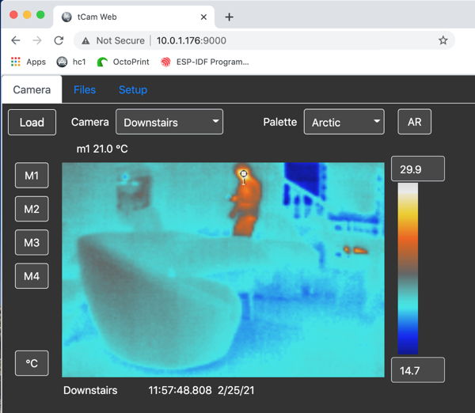
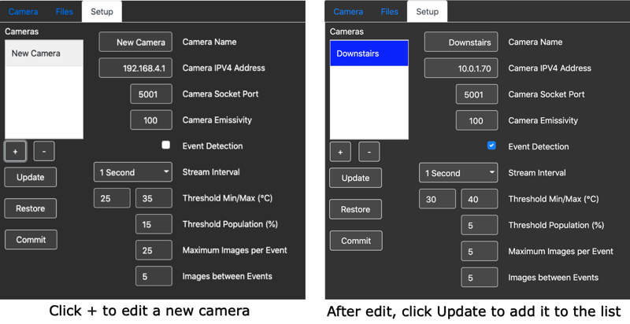
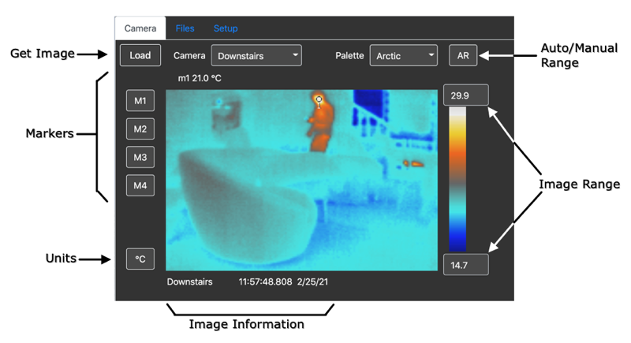
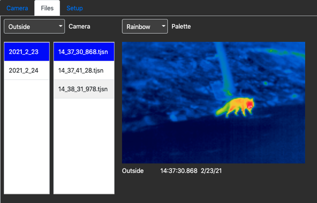
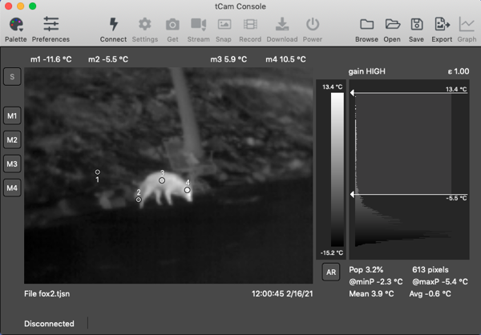

## Simple tCam Web Server

This repository contains a simple web server application for the tCam cameras.  It communicates with one or more cameras via a network connection and acts as web server for viewing images and configuring the system.


It can display an image from a camera or be configured to record images that meet certain detection criteria.  To do this it enables the cameras into streaming mode and analyzes the images it receives.  Right now the detection criteria are very simple.  It will record an image if at least certain percentage of pixels are within a specified temperature range. The image file format is the same as used by the tcam desktop application (containing he image json packet from the camera).

The detection criteria, along with some parameters limiting how many images can be stored based on a detection event, the streaming interval and camera configuration may be setup through the web interface.



The application is developed using the [xojo](https://www.xojo.com) development environment.  Sixty-four bit binary images are provided for Mac OS X, Windows and x86 Linux systems.  A 32-bit binary image is provided for Raspbian.  Download the zip file for your platform.  The application can be run directly from the unzipped directory by double clicking the application binary icon but is primarily designed to be executed from a command line or shell program.

#### Platform Caveats

1. You may need to make the Linux application file executable.
2. You will have to authorize the application to operate through the built-in firewall on OS X or Windows platforms.  Normally those systems will prompt you when the application is started.
3. I haven't tested beyond a handful of cameras and web sessions but the application is probably fairly limited in how many cameras and concurrent web sessions it can support.


### Running the Application
The application is designed to run from the command line.  It supports a small number of command line arguments for configuration (but can be run without any additional command line arguments using default settings).

The application will create a json-based configuration file when it has been configured with one or more cameras to use.  Subsequently it can read this file to configure itself every time it is started.  By default this file is called ```tcam_web_config.json``` and is stored in the user's ```Documents``` subdirectory.

It will also create a subdirectory in an image directory for each camera under which it will store images if detection is enabled and an image streamed from the associated camera meets the detection criteria.  By default the application will create an image directory named ```tcam_web_images``` in the user's ```Documents``` subdirectory.

To execute it directly from a shell prompt, type the command in the binary directory with one or more optional arguments.

```./tcam_web [-c <config>] [-d] [-h] [-i <image_directory>] [--port=<port_num>]```

where

| Configuration Item | Description |
| --- | --- |
| -c \<config> | Specify the absolute path and filename to use for the json configuration file.  The program will create the configuration file but all directories in the path must exist.  Example configurations for OS X/Linux ```-c /home/dan/tcam_web/config.json``` or Windows ```C:\Users\dan\tcam_web\config.json``` |
| -d | Enable additional diagnostic logging |
| -h | Print out the command line options |
| -i \<image_directory> | Specify the absolute path to a directory to use for image storage.  All directories in the path must exist.  The applciation will create a subdirectory for each camera in this directory. For example, ```-i /home/dan/tcam_web``` or ```-i C:\Users\dan\tcam_web``` |
| --port=\<port_num> | Specify a port to use for the web server.  By default the port 9000 is used.  Ports under 1024 (such as the default port 80) may be used if the program is run with root privilege. |

The application must be started in the directory that also contains the libraries and supporting subdirectories that come with it.

Without arguments the configuration file and image files will be created in the default locations.  The application logs some information to stdout as shown in the example below.

```
	$./tcam_web
	tcam_web version 1.0.2
	Application is ready
	Attempting initial connection to 10.0.1.70
	Attempting initial connection to 10.0.1.71
	Connected to 10.0.1.70
	Connected to 10.0.1.71
```
 
The application may be started automatically.  For example for a Linux system with the following assumptions 

1. tcam\_web and associated libraries are installed in ```/usr/local/bin/tcam_web```
2. The configuration file and image directories are to be stored in ```/usr/local/tcam_web```
3. The application will be run as root and serve webpages at the default port :80
4. Output will be written to ```/var/log/tcam_web.log```

tcam\_web can be started in ```/etc/rc.local``` with the following entry.


```
/usr/local/bin/tcam_web/tcam_web -c /usr/local/tcam_web/config.json -i /usr/local/tcam_web --port=80 > /var/log/tcam_web.log 2>&1 &
```


### Configuring Cameras
The first thing to do after getting tcam\_web running for the first time is to connect to it with a web browser and configure it to connect to one or more cameras.  The cameras must have been configured to connect to the same network and their IPV4 addresses must be known (e.g. statically set).

Browse to the address of the computer running tcam_web with the port that it will be using.  Click the "Setup" tab.

#### Adding a Camera


1. Click + to create a new camera and display a default configuration.
2. Edit the configuration, for example giving the camera a friendly name, setting the correct network address and configuring event detection criteria if desired.
3. Click Update to store the configuration in the local list.
4. Click Commit once all cameras have been added to the local list.  This stores the local list in the application's configuration file and initiates a sequence to connect to and configure the cameras.

Note that changes made by clicking Update are only applied to the local list of cameras displayed in the browser.  Commit must be pressed to store and activate the list.  Navigating away from the Setup panel deletes the local list.

After a camera configuration has been stored the Setup panel will display the list of cameras from the configuration file.

Clicking Restore will overwrite the local list of cameras with the list of cameras from the configuration file if one exists.

##### Configuration Parameters
| Item | Description |
| --- | --- |
| Camera Name | Sets a friendly name, displayed in other panels and used to create a camera-specific image directory, for the camera. |
| Camera IPV Address | Sets the network address for the camera. |
| Camera Socket Port | Sets the network socket port for the camera.  Normally this is 5001 and won't be changed. |
| Camera Emissivity | Sets the emissivity for the camera.  May be changed to increase accuracy if the emissivity of important objects in the scene the camera monitors is known. |
| Event Detection | Set to enable event detection using the parameters below the control. Images will be stored if they meet the criteria specified by the parameters. |
| Stream Interval | Select the interval between images streamed from the camera.  Images are recorded at the stream interval so slower intervals are appropriate for scenes with low activity. |
| Threshold Min/Max | Sets the temperature range to search for in °C. |
| Threshold Population | Sets the percent (1-100) of the total image pixels (19200) that must be found between the Threshold Min and Max values to record an image. |
| Maximum Images Per Event | Sets the maximum number of images to record while the Threshold Population is met before waiting Images Between Events number of images from the camera before re-arming detection. |
| Images Between Events | Sets the number of images to receive from the camera after recording Maximum Images Per Event before re-arming detection. |

##### Camera Operating Configuration
The application will set the camera's clock and configure it into a Radiometric operating condition with the specified emissivity upon connection.  Streaming is enabled if Event Detection is enabled.

#### Edit an existing Camera
1. Select the camera to edit from the list.  Its configuration parameters are displayed.
2. Edit the configuration parameters.
3. Click Update the store the parameters back to the local list.
4. Click Commit to save the updated information in the configuration file and reconnect to the list of cameras.

#### Delete a Camera
1. Select the camera to delete from the list.
2. Click - to delete the camera.
3. Click Commit to save the updated list to the configuration file and disconnect from the camera if currently connected.

### Viewing Images
Images from connected cameras may be viewed in the Camera panel.


| Control | Description |
| --- | --- |
| Load | Gets an image from the selected camera.  If Event Detection is enabled this is the last image received from the camera.  If Event Detection is disabled this is a current image. |
| Camera | Selects the camera to display. |
| Palette | Selects a false color palette to apply to the image. The current palette is displayed between the Image Range controls. |
| Auto/Manual Range | Toggles between range types.  In Auto Range the radiometric data is scaled between the lowest and highest temperatures in the data when computing the image.  The highest and lowest temperatures are displayed in the Image Range controls.  In Manual Range the radiometric data is scaled between the temperatures displayed in the Image Range controls. |
| Image Range | Displays the high and low temperatures used to scale the current image.  In Manual Range these may be changed and the image will be rescaled and redisplayed. |
| Markers | The four marker buttons allow selecting points in the displayed image for temperature measurement.  Clicking a marker button causes it to be highlighted.  Clicking in the image adds the marker and the average temperature of the four pixels surrounding the marker point is displayed above the image.  Clicking a marker button twice deletes the marker. |
| Units | Select between °C and °F for temperature units. |
| Image Information | The source and timestamp of the currently displayed image. |

### Events, Recording and Viewing Files
Radiometric image files (.tjsn suffix) are saved when Event Detection has been enabled.  The application creates a subdirectory for each camera using the camera's name.  For each camera it creates subdirectories with names created from the date an event is detected of the form ```YYYY_MM_DD```.  It store image files inside those directories with names created from the image timestamp of the form ```HH_MM_SS_MSEC.tjsn```.



Current date directories are displayed in the left column for the selected camera.  Selecting an entry displays the files for that date in the right column.  Selecting an image file displays it with the selected palette.

#### Using the tcam desktop application to determine detection criteria
The tcam desktop application can be used to configure the camera's network and address as well as to help establish event detection Threshold min/max and Threshold Population parameters using histogram analysis as shown below.



For this example, we wish to configure tcam\_web to detect warm objects in a winter situation.  A representative image is loaded and markers placed to determine the temperature in various parts of the image.  We choose a temperature range using the histogram markers to determine the minimum temperature to detect and the population of pixels the representative image consumes.  In this case the population are all the pixels with temperatures above the minimum.  The maximum temperature simply should be above the maximum we assume we'll see in the object.

Note that this is just a simple example for use as explanation.  In reality more thought must be applied to the temperature range of the background for all situations.