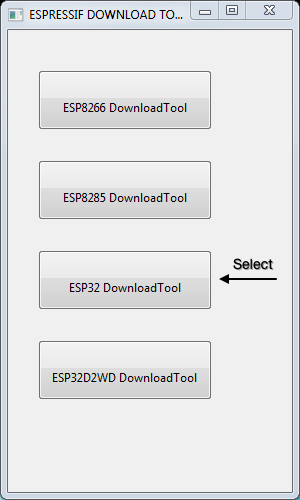
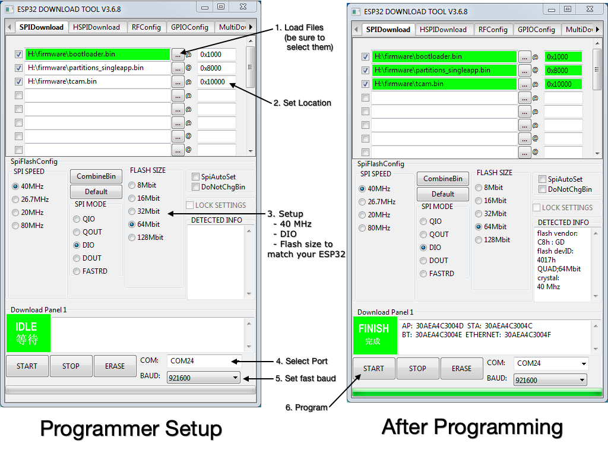

## FireCAM Firmware Upload
There are two ways to load firmware into tCam.

1. Using the Espressif build process after compiling the firmware.
2. Using a download tool from Espressif to load the pre-compiled firmware from this repository.

The second option is described here.  It requires a Microsoft Windows computer.

### Download firmware files
Download the three binary files from this repository to a known location.  All three are required by the Espressif download tool.

```
	firmware/precompiled/bootloader.bin
	firmware/precompiled/tCam.bin
	firmware/precompiled/partitions_singleapp.bin
```

### Connect Camera
Connect the camera to the Windows Computer to allow it to load a device driver for the camera's Silicon Labs USB-Serial chip.  After a few minutes the computer should load a driver and associate a COM port with the camera.  Make a note of this port.  You can find it in the Windows Device Manager.

### Install the Espressif download tool
Download the `flash_download_tools_v3.6.8.zip` file to a Windows computer.  Unzip it in a known location.  It will unzip a directory named `flash_download_tools_v3.6.8`.  Execute the ```flash_download_tools_v3.6.8``` binary from within that directory.

A shell window will appear and then after a few seconds a selection window will appear.



Click the `ESP32 Download Tool` button.  The ESP32 Download Tool program runs and displays a new window.



#### Programmer Setup

1. Load the three firmware files from the location you stored them by clicking on first three `...` buttons as shown above under the `SPIDownload` tab.  The tCam-Mini PCB uses firmware for Rev 3 ESP32.  tCam-Mini's built around off-the-shelf development boards may require the firmware for Rev 1 ESP32 chips.
2. Set the location in ESP32 memory for each file as shown above by clicking in the text fields to the right of each filename.
3. Configure the programming parameters in the `SpiFlashConfig` area.  Select SPI SPEED: 40 MHz, SPI MODE: DIO, FLASH SIZE: to match the flash size of your ESP32 module (4 MB Flash = 32 Mbit, 8 MB Flash = 64 MBit).  tCam-Mini PCBs have 8 MB Flash modules.  tCam-Mini's built from off-the-shelf development boards may have 4 MB Flash modules.
4. Select the COM port associated with the camera.
5. Set a fast baud rate of 921600 baud to reduce programming time.

#### Programming

1. Make sure the camera is on (tCam-Mini is on whenever connected to USB).  It will boot up but this does not matter (the programming software will reset it).
2. For tCam, continue to hold the power button depressed and press `START` to initiate programming.  A green progress bar will progress along the bottom of the window.  Programming should take 15-20 seconds.  The program will display `FINISH` upon a successful programming.
3. Release the power button and then press it again.  The camera should boot into the new firmware.

