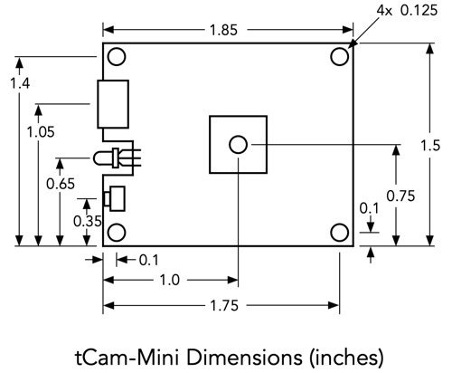
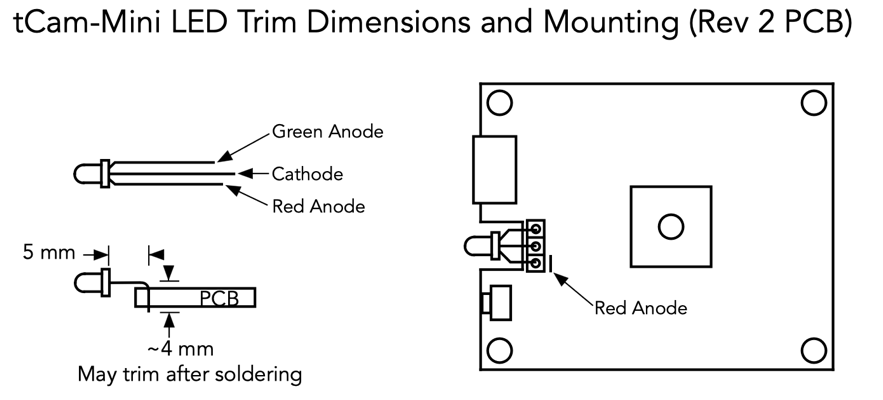
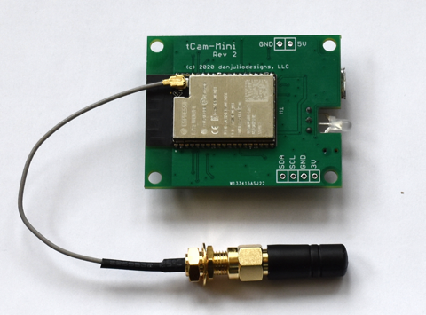

## tCam-Mini Hardware (Rev 2 PCB)
This directory contains design files for tCam-Mini including PCB gerbers, stencil gerbers, a BOM and schematic.

### LED Orientation
The LED is formed, trimed and aligned as shown below.  Lead length may be adjusted to fit an enclosure if desired or so the dome of the LED is beyond the edge of the PCB.

### Header Connections

#### 5V/GND
Connect directly to the USB Vbus (5V) input.  Can be used to power external circuitry or to power the camera.

Care must be taken, when these terminals are used to power the camera, when connecting a USB power source as well, since two 5V power supplies will be connected in parallel.  A solution is to use a schottky diode in series with the external power supply connected to these terminals.  A schottky diode must be used if a battery is connected to these terminals to prevent damage and a possible fire/explosion if power is also connected to USB.

The absolute minimum voltage the camera will operate with applied to these terminals is about 3.6 volts.  The absolute maximum is 5.5 volts.

#### I2C Interface
The camera's internal I2C interface and a 3.0V power supply is availble for external I2C perhipherals.  Power is supplied by the linear regulator that is also supplying the Lepton's VDDIO pad (used for the IO voltage and shutter) and should be limited to 50 mA or less.

### Antenna Selection
You can choose to buy an ESP32 module with a built-in antenna or one with an IPEX (U.FL) connector for use with an external antenna.  I have found slightly better performance using an external antenna.  I have listed both parts in the BOM along with a short cable and antenna I know to work.  Most 2.4 GHz WiFi antennas should be fine.

